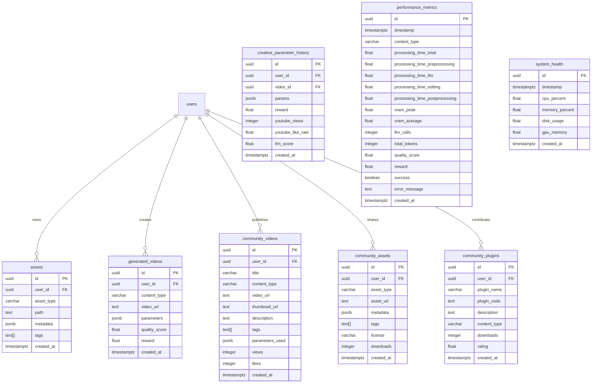

# ClipMontage Universal Platform
## 要件定義書 v2.1

**Document Version**: 2.1  
**作成日**: 2026年1月22日  
**最終更新**: 2026年1月22日  
**ステータス**: Draft  
**作成者**: Takaya

---

## 📑 目次

1. [プロジェクト概要](#1-プロジェクト概要)
2. [システム全体構成](#2-システム全体構成)
3. [機能要件](#3-機能要件)
4. [非機能要件](#4-非機能要件)
5. [技術仕様](#5-技術仕様)
6. [処理フロー](#6-処理フロー)
7. [データベース設計](#7-データベース設計)
8. [API仕様](#8-api仕様)
9. [開発計画](#9-開発計画)
10. [品質保証](#10-品質保証)
11. [付録](#11-付録)

---

## 1. プロジェクト概要

### 1.1 プロジェクト名

**ClipMontage Universal Platform (CMUP)**

### 1.2 背景と目的

#### 背景
- YouTube Shorts、TikTokなどの短尺動画コンテンツの爆発的増加
- 高品質な動画編集には専門知識と時間が必要
- ゲーム実況、MAD動画、スポーツハイライトなど多様なニーズ
- AI技術の進化により自動化の可能性が拡大

#### 目的
長尺の生動画データから視聴者に共感・認知される高品質な短尺動画を自動生成する汎用動画制作プラットフォームを構築する。

**核心的価値**:
1. **創造性の自動化**: AIが芸術的な動画を生成
2. **報酬ベース学習**: YouTube再生数から継続的に改善
3. **拡張性**: プラグインで多様なコンテンツタイプに対応
4. **コミュニティ駆動**: ユーザーが素材・プラグインを共有

### 1.3 スコープ

#### 対象範囲 (In Scope)
- ゲームモンタージュ動画の自動生成
- MAD/AMV動画の自動生成
- スポーツハイライト動画の自動生成
- アニメPV動画の自動生成
- ミュージックビデオの自動生成
- 2次元キャラクター音声合成（VOICEVOX）
- YouTube自動アップロード
- 報酬ベース学習システム
- コミュニティプラットフォーム
- 開発者・研究者向けダッシュボード

#### 対象外 (Out of Scope)
- リアルタイムストリーミング配信
- 3D動画生成
- VR/AR対応
- モバイルアプリ（初期フェーズ）
- 商用動画制作サービス（初期フェーズ）

### 1.4 想定ユーザー

| ユーザータイプ | 特徴 | ニーズ |
|-------------|------|--------|
| ゲーム実況者 | ゲームプレイ動画を投稿 | ハイライトシーンの自動抽出・編集 |
| アニメファン | MAD動画を作成 | 音楽と映像の完璧な同期 |
| スポーツファン | 試合ハイライトを作成 | 決定的瞬間の自動検出 |
| 音楽クリエイター | MVを作成 | ビジュアルエフェクトの自動生成 |
| 開発者 | プラグイン開発 | 拡張可能なAPI |
| 研究者 | AIアルゴリズム研究 | 性能データ・分析ツール |

### 1.5 KPI（重要業績評価指標）

| 指標 | 目標値（3ヶ月後） |
|-----|-----------------|
| 月間動画生成数 | 1,000本 |
| 平均品質スコア | 80点以上 |
| YouTube平均再生数 | 500回/動画 |
| ユーザー満足度 | 4.0/5.0以上 |
| 処理時間 | 5分以内/動画 |
| プラグイン数 | 10個以上（コミュニティ含む） |

---

## 2. システム全体構成

### 2.1 アーキテクチャ図


### 2.2 技術スタック

#### Frontend
| 項目 | 技術 | バージョン | 用途 |
|-----|------|----------|------|
| Framework | Next.js | 14.x | Webアプリケーション |
| UI Library | React | 18.x | UI構築 |
| Styling | Tailwind CSS | 3.x | スタイリング |
| Charts | Recharts | 2.x | データ可視化 |
| State Management | Zustand | 4.x | 状態管理 |
| Form | React Hook Form | 7.x | フォーム管理 |

#### Backend
| 項目 | 技術 | バージョン | 用途 |
|-----|------|----------|------|
| Framework | FastAPI | 0.109.x | REST API |
| Language | Python | 3.11+ | バックエンド言語 |
| Task Queue | Celery | 5.x | 非同期タスク |
| Message Broker | Redis | 7.x | タスクキュー |
| WebSocket | FastAPI WebSocket | - | リアルタイム通信 |

#### AI/ML
| 項目 | 技術 | バージョン | 用途 |
|-----|------|----------|------|
| LLM | Ollama | - | ローカルLLM実行 |
| Model | Qwen2.5 | 7B | 創造性評価・分析 |
| ML Framework | scikit-learn | 1.4.x | ベイズ最適化 |
| Optimization | scipy | 1.12.x | 統計処理 |
| LangChain | LangChain | 0.1.x | LLMオーケストレーション |
| LangGraph | LangGraph | 0.0.x | 階層的エージェント |

#### Media Processing
| 項目 | 技術 | バージョン | 用途 |
|-----|------|----------|------|
| Video | FFmpeg | 6.x | 動画編集 |
| Audio | librosa | 0.10.x | 音声解析 |
| Image | OpenCV | 4.9.x | 画像処理 |
| Voice Synthesis | VOICEVOX | - | 音声合成 |

#### Database & Storage
| 項目 | 技術 | バージョン | 用途 |
|-----|------|----------|------|
| Database | PostgreSQL | 15.x | RDB |
| Auth | Supabase Auth | - | 認証・認可 |
| Storage | Supabase Storage | - | ファイルストレージ |
| Vector DB | pgvector | 0.5.x | セマンティック検索 |
| Cache | Redis | 7.x | キャッシュ |

#### Infrastructure
| 項目 | 技術 | バージョン | 用途 |
|-----|------|----------|------|
| Container | Docker | 24.x | コンテナ化 |
| Orchestration | Docker Compose | 2.x | 開発環境 |
| Server | Ubuntu | 24.04 | OS |
| GPU | CUDA | 12.x | GPU演算 |

#### External APIs
| 項目 | 技術 | 用途 |
|-----|------|------|
| YouTube Data API | v3 | 動画アップロード・統計取得 |
| VOICEVOX API | - | 音声合成 |

### 2.3 開発環境

#### ハードウェア要件
| 項目 | 最小要件 | 推奨要件 |
|-----|---------|---------|
| CPU | 4コア | 8コア以上 |
| RAM | 16GB | 32GB以上 |
| GPU | NVIDIA 11GB VRAM | NVIDIA 24GB VRAM |
| Storage | 100GB SSD | 500GB NVMe SSD |

#### ソフトウェア要件
- Ubuntu 24.04 LTS
- Docker 24.x
- NVIDIA Driver 535.x以上
- CUDA 12.x
- Python 3.11+
- Node.js 20.x+

---

## 3. 機能要件

### 3.1 機能一覧

| ID | 機能名 | 優先度 | 説明 |
|----|--------|--------|------|
| F-001 | ユーザー認証 | Must | Supabase Authによる認証 |
| F-002 | 素材アップロード | Must | 動画・音声・画像のアップロード |
| F-003 | コンテンツタイプ選択 | Must | ゲーム/MAD/スポーツ/アニメPV/MV |
| F-004 | 動画自動生成 | Must | AIによる動画生成 |
| F-005 | YouTube自動アップロード | Must | YouTube APIで自動投稿 |
| F-006 | 品質評価 | Must | 100点満点の品質スコア |
| F-007 | 品質フィードバックループ | Must | 70点未満で再生成 |
| F-008 | VOICEVOX音声合成 | Should | キャラクター音声追加 |
| F-009 | プレビュー機能 | Should | 生成前のプレビュー |
| F-010 | 動画管理 | Must | 生成履歴・ダウンロード |
| F-011〜F-027 | v2.0機能 | - | YouTube学習、マルチエージェント等 |
| F-028 | 創造性パラメータ最適化 | Must | ベイズ最適化 |
| F-029 | Exploration/Exploitation戦略 | Should | Thompson Sampling |
| F-030 | パラメータ履歴管理 | Must | JSON保存 |
| F-031 | Creative Intelligence Layer | Must | 4つのLLMエージェント |
| F-032 | LLM-報酬統合システム | Must | YouTube + LLM評価 |
| F-033 | 説明可能な創造性 | Should | レポート生成 |
| F-034 | パターン学習・提案システム | Must | 成功パターン分析 |
| F-035 | Multi-Asset Management System | Must | マルチモーダル素材管理 |
| F-036 | Content Type Plugin System | Must | プラグイン拡張 |
| F-037 | Universal 3-Director System | Must | コンテンツタイプ別設定 |
| F-038 | Community Platform | Should | 動画・素材・プラグイン共有 |
| F-039 | Content-Type Specific Quality Metrics | Must | タイプ別品質基準 |
| F-040 | Character Voice Integration | Should | 音声ライブラリ |
| F-041 | Developer & Researcher Dashboard | Must | 性能監視・分析 |
| F-042 | A/Bテスト機能 | Should | パラメータ比較 |

### 3.2 Core Engine機能

#### F-035: Multi-Asset Management System

**概要**: 動画・音声・イラスト・テキストなどの統一管理

**詳細仕様**:
```python
class AssetType(Enum):
    VIDEO = "video"
    AUDIO = "audio"
    IMAGE = "image"
    CHARACTER_VOICE = "character_voice"
    MUSIC = "music"
    ILLUSTRATION = "illustration"
    TEXT = "text"
    EFFECT = "effect"
```

**機能**:
1. **素材インポート**
   - ファイルアップロード
   - メタデータ自動抽出
   - Supabase Storageへ保存

2. **素材検索**
   - タグベース検索
   - セマンティック検索（pgvector）
   - フィルタリング（タイプ・日付・サイズ）

3. **素材管理**
   - 編集・削除
   - タグ付け
   - お気に入り

**入力**:
- ファイル（動画/音声/画像/テキスト）
- タグ（任意）

**出力**:
- Asset ID
- Storage URL
- メタデータ

**性能要件**:
- アップロード速度: 100MB/秒以上
- 検索応答時間: 500ms以内

---

#### F-037: Universal 3-Director System

**概要**: コンテンツタイプに応じて監督を動的設定

**3監督の役割**:

**1. Movie Director（映像監督）**
- シナリオ設計（起承転結の尺・配分）
- 絵コンテ生成（シーン選択・順序）
- カット割り決定
- テンポ・リズム設定

**2. Visual Director（ビジュアル監督）**
- 色彩方針決定（カラーグレーディング）
- エフェクト適用
- トランジション選択
- 視覚的統一感の管理

**3. Music Director（音楽監督）**
- ビート同期
- 音楽テンポマッチング
- BGM・効果音配置
- 音声バランス調整

**コンテンツタイプ別設定**:

| コンテンツタイプ | Movie Director | Visual Director | Music Director |
|---------------|----------------|-----------------|----------------|
| ゲームモンタージュ | ハイライト重視 | Vivid（鮮やか） | ビート重視 |
| MAD/AMV | 歌詞同期 | Cinematic | 歌詞-映像一致 |
| スポーツハイライト | 決定的瞬間 | Dramatic | 興奮曲線 |
| アニメPV | ストーリービート | キャラクター重視 | ムード一致 |
| ミュージックビデオ | リズム視覚化 | Abstract | 完全同期 |

**処理フロー**:
1. コンテンツタイプに応じて監督を設定
2. 各監督が素材を分析
3. 統合された制作計画を立案
4. 並行して実行
5. 最終統合

---

### 3.3 Creative Intelligence Layer

#### F-031: Creative Intelligence Layer

**概要**: 4つのLLMエージェントによる創造性管理

**エージェント構成**:

**1. Creative Critic Agent（創造性評価者）**
- 生成された動画を多次元評価
- 芸術的観点から言語でレポート
- 改善提案の生成

**評価軸**:
- リズム感（0-100点）
- 視覚的インパクト（0-100点）
- 芸術的一貫性（0-100点）
- 独創性（0-100点）

**出力形式（JSON）**:
```json
{
  "overall_score": 85,
  "rhythm_quality": {
    "score": 90,
    "analysis": "カットのテンポが音楽のビートと完璧に同期..."
  },
  "visual_impact": {
    "score": 80,
    "analysis": "色調が統一され、エフェクトが適切..."
  },
  "key_strengths": ["ビート同期精度", "色調統一感"],
  "improvement_suggestions": ["カット頻度を28→32に"],
  "creative_direction": "次回はより大胆なトランジションを試すべき"
}
```

**2. Pattern Analyzer Agent（パターン分析者）**
- 過去の成功パターンを分析
- パラメータ間の相関を発見
- 未探索の有望な組み合わせを提案

**分析項目**:
- 成功パターン（Top 5動画の共通点）
- 失敗パターン（Bottom 5動画の共通点）
- パラメータ相関（例：「カット頻度↑→彩度↑で成功率UP」）
- 未探索領域の提案

**3. Comment Analyzer Agent（コメント分析者）**
- YouTubeコメントから視聴者の好みを抽出
- パラメータへの具体的改善提案

**分析内容**:
- 感情分析（ポジティブ/ネガティブ比率）
- テーマ抽出（頻出キーワード）
- 視聴者嗜好の定量化

**4. Meta Director Agent（総合監督）**
- 全分析を統合して創造的ビジョン策定
- 3監督への具体的指示生成

**出力形式**:
```json
{
  "creative_vision": "次の動画は『疾走感と静寂のコントラスト』をテーマに",
  "director_instructions": {
    "movie_director": {
      "narrative_strategy": "起0.15/承0.35/転0.35/結0.15",
      "cut_strategy": "クライマックス前に0.2秒の無音挿入"
    },
    "visual_director": {
      "color_strategy": "彩度1.3倍、コントラスト1.2倍",
      "effect_philosophy": "エフェクトは控えめに、映像本来の美しさを"
    },
    "music_director": {
      "sync_priority": "ビート同期精度95%以上",
      "silence_usage": "クライマックス前の演出的無音"
    }
  }
}
```

**LLM使用回数**:
- 動画生成前: 2回（Pattern Analyzer + Meta Director）
- 動画生成中: 3回（シナリオ + 絵コンテ + 色彩方針）
- 動画生成後: 2回（Creative Critic + Comment Analyzer）
- **合計: 7回/動画**

**VRAM使用量**:
- モデル: qwen2.5:7b（約5GB）
- 逐次実行（keep_alive=0）
- 総実行時間: 約3-5分（LLM部分のみ）

---

#### F-032: LLM-報酬統合システム

**概要**: YouTube再生数とLLM評価を統合した報酬計算

**報酬計算式**:
```
reward = 
  (YouTube再生数 / 300) × 0.3 +
  (いいね率 × 100) × 0.15 +
  (視聴維持率) × 0.15 +
  (LLM評価スコア / 100) × 0.4
```

**重み配分の理由**:
- YouTube指標（60%）: 客観的な視聴者反応
- LLM評価（40%）: 芸術的品質・創造性

**報酬の使用**:
1. ベイズ最適化の目的関数
2. パラメータの良し悪し判定
3. 学習進捗の可視化

---

#### F-034: パターン学習・提案システム

**概要**: 成功パターンを学習し、次回パラメータを提案

**ベイズ最適化**:
```python
class CreativeParameterOptimizer:
    def __init__(self):
        self.gp = GaussianProcessRegressor()
        self.history = []
    
    def suggest_next_params(self):
        # Acquisition Function（期待改善度）
        # で次のパラメータを探索
        pass
```

**パラメータ空間**:
```python
param_space = {
    'cut_frequency': (15, 35),  # カット/分
    'narrative_distribution': {
        '起': (0.15, 0.25),
        '承': (0.25, 0.35),
        '転': (0.25, 0.35),
        '結': (0.15, 0.25)
    },
    'transition_creativity': (0.5, 1.0),
    'color_intensity': (0.8, 1.5),
    'contrast': (0.9, 1.3),
    'saturation': (0.9, 1.3),
    'effect_density': (5, 20),
    'beat_sync_tolerance': (0.02, 0.1),
    'tempo_variation': (0.8, 1.2),
    'silence_usage': (0.0, 0.3)
}
```

**探索戦略**:
- Thompson Sampling
- Exploration（30%）: ランダム探索
- Exploitation（70%）: ベイズ最適化

**収束条件**:
- 30本生成後、報酬の標準偏差が0.1以下

---

### 3.4 Plugin System

#### F-036: Content Type Plugin System

**概要**: プラグインで多様なコンテンツタイプに対応

**プラグインインターフェース**:
```python
class ContentTypePlugin(ABC):
    @property
    @abstractmethod
    def name(self) -> str:
        """プラグイン名"""
        pass
    
    @property
    @abstractmethod
    def supported_asset_types(self) -> List[AssetType]:
        """サポートする素材タイプ"""
        pass
    
    @abstractmethod
    def get_requirements_template(self) -> Dict:
        """要件定義テンプレート"""
        pass
    
    @abstractmethod
    def preprocess_assets(self, assets: List[Asset]) -> List[Asset]:
        """素材の前処理"""
        pass
    
    @abstractmethod
    def get_director_config(self) -> Dict:
        """監督システムの設定"""
        pass
    
    @abstractmethod
    def get_quality_metrics(self) -> Dict:
        """品質評価指標"""
        pass
    
    @abstractmethod
    def postprocess(self, video_path: str) -> str:
        """後処理"""
        pass
```

**組み込みプラグイン**:

**1. Game Montage Plugin**
- ハイライト検出（キル/デス/スキル使用）
- プレイヤー追跡
- スコアボード検出
- 実況音声の自動配置

**2. MAD/AMV Plugin**
- インパクトフレーム検出
- 感情シーン検出（涙・決意・抱擁）
- 歌詞-映像同期（lyrical literalism）
- フィルム風エフェクト

**3. Sports Highlight Plugin**
- 決定的瞬間検出（ゴール/ダンク/ホームラン）
- 観客歓声検出
- スローモーション・リプレイ
- アニメスタイル化フィルタ

**4. Anime PV Plugin**
- ストーリービート検出
- キャラクター顔認識
- 感情的クライマックス抽出
- テーマ曲同期

**5. Music Video Plugin**
- ビート視覚化
- カレイドスコープエフェクト
- アブストラクトアート生成
- 完全ビート同期

**プラグインレジストリ**:
```python
class PluginRegistry:
    def __init__(self):
        self.plugins: Dict[str, ContentTypePlugin] = {}
        self.load_builtin_plugins()
    
    def register(self, plugin: ContentTypePlugin):
        """プラグイン登録"""
        self.plugins[plugin.name] = plugin
    
    def get_plugin(self, content_type: str):
        """プラグイン取得"""
        return self.plugins.get(content_type)
    
    def load_user_plugin(self, plugin_path: str):
        """ユーザープラグインのロード"""
        # Python動的インポート
        pass
```

**ユーザープラグイン開発**:
1. `ContentTypePlugin`を継承
2. 必要なメソッドを実装
3. `.py`ファイルとしてアップロード
4. 自動的にレジストリに登録

---

### 3.5 Community Platform

#### F-038: Community Platform

**概要**: ユーザー投稿型プラットフォーム

**機能**:

**1. 動画共有**
- 生成した動画を公開
- いいね・コメント
- 再生回数カウント
- タグ検索
- トレンドランキング

**2. 素材共有**
- アニメ素材の共有
- イラストの共有
- 音楽の共有
- ライセンス設定（CC-BY推奨）
- ダウンロード数カウント

**3. プラグイン共有**
- プラグインコードの公開
- 説明・使い方
- レーティング（5段階）
- ダウンロード数
- フォーク機能

**4. フィードバック機能**
- 動画へのコメント
- 改善提案
- バグ報告

**データベーステーブル**:
```sql
CREATE TABLE community_videos (
    id UUID PRIMARY KEY,
    user_id UUID REFERENCES auth.users(id),
    title VARCHAR(200),
    content_type VARCHAR(50),
    video_url TEXT,
    thumbnail_url TEXT,
    description TEXT,
    tags TEXT[],
    parameters_used JSONB,
    views INTEGER DEFAULT 0,
    likes INTEGER DEFAULT 0,
    created_at TIMESTAMPTZ DEFAULT NOW()
);

CREATE TABLE community_assets (
    id UUID PRIMARY KEY,
    user_id UUID REFERENCES auth.users(id),
    asset_type VARCHAR(50),
    asset_url TEXT,
    metadata JSONB,
    tags TEXT[],
    license VARCHAR(50),
    downloads INTEGER DEFAULT 0,
    created_at TIMESTAMPTZ DEFAULT NOW()
);

CREATE TABLE community_plugins (
    id UUID PRIMARY KEY,
    user_id UUID REFERENCES auth.users(id),
    plugin_name VARCHAR(100),
    plugin_code TEXT,
    description TEXT,
    content_type VARCHAR(50),
    downloads INTEGER DEFAULT 0,
    rating FLOAT DEFAULT 0.0,
    created_at TIMESTAMPTZ DEFAULT NOW()
);
```

---

### 3.6 Developer Dashboard

#### F-041: Developer & Researcher Dashboard

**概要**: 開発者・研究者向けの性能監視・分析ダッシュボード

**主要機能**:

**1. パフォーマンスメトリクス**
- 処理時間の内訳（前処理/LLM/編集/後処理）
- VRAM使用量（ピーク/平均）
- LLM呼び出し回数・トークン数
- エラー率・成功率

**表示項目**:
```
┌────────────────────────────────────────┐
│ 平均処理時間: 4.2秒                     │
│ ピークVRAM: 8.5GB                       │
│ 平均品質スコア: 82点                    │
│ 成功率: 85%                             │
└────────────────────────────────────────┘
```

**2. 品質分析**
- 品質スコア推移（時系列グラフ）
- パラメータと品質の相関分析
- 報酬分布ヒストグラム
- コンテンツタイプ別品質比較

**相関分析例**:
```
カット頻度 ↔ 品質: r=0.65（強い正の相関）
彩度 ↔ 品質: r=0.42（中程度の正の相関）
エフェクト密度 ↔ 品質: r=-0.15（弱い負の相関）
```

**3. 学習進捗**
- パラメータ進化推移
- 探索/活用比率
- 収束状況グラフ
- ベイズ最適化のAcquisition Function可視化

**4. ユーザー行動**
- コンテンツタイプ別利用分布（円グラフ）
- プラグイン人気度ランキング
- 動画生成数推移（折れ線グラフ）
- ユーザー満足度評価（5段階）

**5. システムヘルス**
- CPU/メモリ/ディスク使用率（リアルタイム）
- GPU Memory使用量
- ネットワーク帯域
- アラート通知（閾値超過時）

**更新頻度**:
- リアルタイムメトリクス: 10秒ごと
- 統計データ: 1分ごと
- 学習進捗: 1動画生成ごと

**技術スタック**:
- Frontend: Next.js + Recharts
- Backend: FastAPI + WebSocket
- DB: PostgreSQL (Supabase)
- Monitoring: psutil

**APIエンドポイント**:
```
GET /api/dev-dashboard/performance/summary?days=7
GET /api/dev-dashboard/performance/timeseries?metric=processing_time
GET /api/dev-dashboard/quality/parameter-correlation
GET /api/dev-dashboard/usage/content-type-distribution
GET /api/dev-dashboard/system/health
GET /api/dev-dashboard/learning/reward-distribution
GET /api/dev-dashboard/learning/parameter-evolution?param=cut_frequency
```

**アクセス制御**:
- 開発者・研究者のみアクセス可能
- Role-Based Access Control (RBAC)
- Supabase RLSで実装

---

## 4. 非機能要件

### 4.1 性能要件

| 項目 | 目標値 |
|-----|--------|
| 動画生成時間 | 5分以内（60秒動画） |
| 同時処理可能数 | 5動画 |
| API応答時間 | 200ms以内（GET） |
| ファイルアップロード | 100MB/秒 |
| YouTube API制限 | 10,000クエリ/日 |
| LLM推論時間 | 30秒以内/回 |
| VRAM使用量 | 9GB以内（ピーク） |
| ディスク容量 | 素材: 10GB/ユーザー |

### 4.2 可用性

| 項目 | 目標値 |
|-----|--------|
| システム稼働率 | 99%以上 |
| 計画メンテナンス | 月1回、深夜2時間 |
| バックアップ頻度 | 日次（自動） |
| リカバリ時間 | 4時間以内 |

### 4.3 セキュリティ

**認証・認可**:
- Supabase Auth（Email/パスワード、OAuth）
- Row Level Security (RLS)
- JWT Token認証

**データ保護**:
- 通信: HTTPS（TLS 1.3）
- ストレージ: 暗号化（AES-256）
- パスワード: bcryptハッシュ化

**アクセス制御**:
```sql
-- 自分の動画のみ閲覧・編集可能
CREATE POLICY "Users can view own videos"
ON generated_videos FOR SELECT
USING (auth.uid() = user_id);

CREATE POLICY "Users can update own videos"
ON generated_videos FOR UPDATE
USING (auth.uid() = user_id);
```

**入力検証**:
- ファイルサイズ制限: 500MB/ファイル
- ファイルタイプ検証: MIMEタイプチェック
- XSS対策: サニタイゼーション
- CSRF対策: CSRFトークン

### 4.4 拡張性

**水平スケーリング**:
- FastAPIサーバー: 複数インスタンス（ロードバランサ）
- Celery Worker: 動的スケーリング
- Redis: クラスタ構成

**垂直スケーリング**:
- GPU追加: CUDA Multi-GPU対応
- メモリ増設: キャッシュサイズ拡大

**プラグイン拡張**:
- ユーザープラグイン: 無制限
- 組み込みプラグイン: 順次追加

### 4.5 保守性

**ログ**:
- アプリケーションログ: JSON形式
- アクセスログ: 標準出力
- エラーログ: Sentry連携
- 保存期間: 30日

**監視**:
- ヘルスチェック: `/health`エンドポイント
- メトリクス: Prometheus + Grafana
- アラート: Discord/Email通知

**バージョン管理**:
- Git: GitHub
- ブランチ戦略: Git Flow
- タグ: セマンティックバージョニング

**ドキュメント**:
- API: OpenAPI (Swagger)
- コード: Docstring
- ユーザーマニュアル: Notion

---

## 5. 技術仕様

### 5.1 LLM仕様

**モデル**: Qwen2.5:7B

**Ollama設定**:
```bash
# 環境変数
OLLAMA_MAX_LOADED_MODELS=1
OLLAMA_NUM_PARALLEL=1
OLLAMA_KEEP_ALIVE=0  # 即座アンロード
OLLAMA_FLASH_ATTENTION=1
OLLAMA_KV_CACHE_TYPE=q8_0
```

**プロンプト設計**:
- システムプロンプト: 役割定義
- ユーザープロンプト: タスク指示
- JSON出力強制: `format='json'`

**トークン制限**:
- 入力: 4096トークン
- 出力: 2048トークン

### 5.2 動画処理仕様

**FFmpeg設定**:
```bash
# 動画エンコード
ffmpeg -i input.mp4 \
  -c:v libx264 \
  -preset fast \
  -crf 23 \
  -c:a aac \
  -b:a 128k \
  output.mp4
```

**解像度**:
- 入力: 任意（自動リサイズ）
- 出力: 1920x1080（Full HD）
- フレームレート: 30fps

**ビットレート**:
- 映像: 5Mbps
- 音声: 128kbps

### 5.3 音声処理仕様

**Librosa**:
```python
# ビート検出
tempo, beats = librosa.beat.beat_track(y=audio, sr=sr)

# スペクトログラム
S = librosa.feature.melspectrogram(y=audio, sr=sr)

# MFCC
mfcc = librosa.feature.mfcc(y=audio, sr=sr, n_mfcc=13)
```

**VOICEVOX**:
```python
# 音声合成
synthesis_params = {
    'speaker': 1,  # キャラクターID
    'text': 'こんにちは',
    'speed': 1.0,
    'pitch': 0.0,
    'intonation': 1.0
}
```

---

## 6. 処理フロー

### 6.1 動画生成処理フロー


### 6.2 Creative Intelligence シーケンス図


### 6.3 Plugin System クラス図


---

## 7. データベース設計

### 7.1 ER図



### 7.2 テーブル定義

#### users（Supabase Auth管理）
```sql
-- Supabase Authが自動管理
-- auth.users テーブル
```

#### assets（素材管理）
```sql
CREATE TABLE assets (
    id UUID PRIMARY KEY DEFAULT uuid_generate_v4(),
    user_id UUID REFERENCES auth.users(id) ON DELETE CASCADE,
    asset_type VARCHAR(50) NOT NULL,
    path TEXT NOT NULL,
    metadata JSONB,
    tags TEXT[],
    created_at TIMESTAMPTZ DEFAULT NOW()
);

CREATE INDEX idx_assets_user_id ON assets(user_id);
CREATE INDEX idx_assets_asset_type ON assets(asset_type);
CREATE INDEX idx_assets_tags ON assets USING GIN(tags);
```

#### generated_videos（生成動画）
```sql
CREATE TABLE generated_videos (
    id UUID PRIMARY KEY DEFAULT uuid_generate_v4(),
    user_id UUID REFERENCES auth.users(id) ON DELETE CASCADE,
    content_type VARCHAR(50) NOT NULL,
    video_url TEXT NOT NULL,
    thumbnail_url TEXT,
    parameters JSONB,
    quality_score FLOAT,
    reward FLOAT,
    youtube_video_id VARCHAR(20),
    created_at TIMESTAMPTZ DEFAULT NOW()
);

CREATE INDEX idx_videos_user_id ON generated_videos(user_id);
CREATE INDEX idx_videos_content_type ON generated_videos(content_type);
CREATE INDEX idx_videos_created_at ON generated_videos(created_at DESC);
```

#### community_videos（コミュニティ動画）
```sql
CREATE TABLE community_videos (
    id UUID PRIMARY KEY DEFAULT uuid_generate_v4(),
    user_id UUID REFERENCES auth.users(id) ON DELETE CASCADE,
    title VARCHAR(200) NOT NULL,
    content_type VARCHAR(50) NOT NULL,
    video_url TEXT NOT NULL,
    thumbnail_url TEXT,
    description TEXT,
    tags TEXT[],
    parameters_used JSONB,
    views INTEGER DEFAULT 0,
    likes INTEGER DEFAULT 0,
    created_at TIMESTAMPTZ DEFAULT NOW()
);

CREATE INDEX idx_community_videos_content_type ON community_videos(content_type);
CREATE INDEX idx_community_videos_tags ON community_videos USING GIN(tags);
CREATE INDEX idx_community_videos_views ON community_videos(views DESC);
CREATE INDEX idx_community_videos_created_at ON community_videos(created_at DESC);
```

#### creative_parameter_history（パラメータ履歴）
```sql
CREATE TABLE creative_parameter_history (
    id UUID PRIMARY KEY DEFAULT uuid_generate_v4(),
    user_id UUID REFERENCES auth.users(id) ON DELETE CASCADE,
    video_id UUID REFERENCES generated_videos(id) ON DELETE CASCADE,
    params JSONB NOT NULL,
    reward FLOAT,
    youtube_views INTEGER,
    youtube_like_rate FLOAT,
    llm_score FLOAT,
    created_at TIMESTAMPTZ DEFAULT NOW()
);

CREATE INDEX idx_param_history_user_id ON creative_parameter_history(user_id);
CREATE INDEX idx_param_history_reward ON creative_parameter_history(reward DESC);
CREATE INDEX idx_param_history_created_at ON creative_parameter_history(created_at);
```

#### performance_metrics（性能メトリクス）
```sql
CREATE TABLE performance_metrics (
    id UUID PRIMARY KEY DEFAULT uuid_generate_v4(),
    timestamp TIMESTAMPTZ NOT NULL,
    content_type VARCHAR(50),
    processing_time_total FLOAT,
    processing_time_preprocessing FLOAT,
    processing_time_llm FLOAT,
    processing_time_editing FLOAT,
    processing_time_postprocessing FLOAT,
    vram_peak FLOAT,
    vram_average FLOAT,
    llm_calls INTEGER,
    total_tokens INTEGER,
    quality_score FLOAT,
    reward FLOAT,
    success BOOLEAN,
    error_message TEXT,
    created_at TIMESTAMPTZ DEFAULT NOW()
);

CREATE INDEX idx_perf_metrics_timestamp ON performance_metrics(timestamp);
CREATE INDEX idx_perf_metrics_content_type ON performance_metrics(content_type);
```

### 7.3 Row Level Security (RLS)

```sql
-- 自分の素材のみアクセス可能
CREATE POLICY "Users can view own assets"
ON assets FOR SELECT
USING (auth.uid() = user_id);

CREATE POLICY "Users can insert own assets"
ON assets FOR INSERT
WITH CHECK (auth.uid() = user_id);

CREATE POLICY "Users can update own assets"
ON assets FOR UPDATE
USING (auth.uid() = user_id);

CREATE POLICY "Users can delete own assets"
ON assets FOR DELETE
USING (auth.uid() = user_id);

-- 自分の動画のみ管理可能
CREATE POLICY "Users can view own videos"
ON generated_videos FOR SELECT
USING (auth.uid() = user_id);

CREATE POLICY "Users can insert own videos"
ON generated_videos FOR INSERT
WITH CHECK (auth.uid() = user_id);

-- コミュニティ動画は全員閲覧可能
CREATE POLICY "Anyone can view community videos"
ON community_videos FOR SELECT
USING (true);

CREATE POLICY "Users can insert own community videos"
ON community_videos FOR INSERT
WITH CHECK (auth.uid() = user_id);
```

---

## 8. API仕様

### 8.1 認証API

#### POST /api/auth/signup
ユーザー登録

**Request**:
```json
{
  "email": "user@example.com",
  "password": "password123"
}
```

**Response**:
```json
{
  "user": {
    "id": "uuid",
    "email": "user@example.com"
  },
  "session": {
    "access_token": "jwt_token"
  }
}
```

#### POST /api/auth/login
ログイン

**Request**:
```json
{
  "email": "user@example.com",
  "password": "password123"
}
```

**Response**:
```json
{
  "session": {
    "access_token": "jwt_token",
    "refresh_token": "refresh_token"
  }
}
```

### 8.2 素材管理API

#### POST /api/assets/upload
素材アップロード

**Request** (multipart/form-data):
```
file: [binary]
asset_type: "video"
tags: ["game", "valorant"]
```

**Response**:
```json
{
  "asset_id": "uuid",
  "path": "https://storage.supabase.co/...",
  "metadata": {
    "duration": 120.5,
    "resolution": "1920x1080"
  }
}
```

#### GET /api/assets
素材一覧取得

**Query Parameters**:
- `asset_type`: フィルタ（video/audio/image）
- `tags`: タグフィルタ
- `page`: ページ番号
- `limit`: 件数

**Response**:
```json
{
  "assets": [
    {
      "id": "uuid",
      "asset_type": "video",
      "path": "url",
      "tags": ["game"],
      "created_at": "2026-01-22T12:00:00Z"
    }
  ],
  "total": 50,
  "page": 1,
  "limit": 20
}
```

### 8.3 動画生成API

#### POST /api/videos/generate
動画生成

**Request**:
```json
{
  "content_type": "game_montage",
  "assets": ["asset_id1", "asset_id2"],
  "requirements": {
    "target_duration": 60,
    "music_genre": "epic",
    "include_commentary": true
  },
  "creative_params": {
    "cut_frequency": 28,
    "color_intensity": 1.3
  }
}
```

**Response**:
```json
{
  "job_id": "uuid",
  "status": "processing",
  "estimated_time": 300
}
```

#### GET /api/videos/status/{job_id}
生成状況確認

**Response**:
```json
{
  "job_id": "uuid",
  "status": "completed",
  "progress": 100,
  "video_url": "https://storage.supabase.co/...",
  "quality_score": 85,
  "creative_report": {
    "overall_score": 85,
    "key_strengths": ["ビート同期精度"],
    "improvement_suggestions": []
  }
}
```

#### GET /api/videos
動画一覧取得

**Query Parameters**:
- `content_type`: フィルタ
- `page`: ページ番号
- `limit`: 件数

**Response**:
```json
{
  "videos": [
    {
      "id": "uuid",
      "content_type": "game_montage",
      "video_url": "url",
      "quality_score": 85,
      "created_at": "2026-01-22T12:00:00Z"
    }
  ],
  "total": 30,
  "page": 1
}
```

### 8.4 Developer Dashboard API

#### GET /api/dev-dashboard/performance/summary
性能サマリー取得

**Query Parameters**:
- `days`: 日数（デフォルト: 7）

**Response**:
```json
{
  "average_processing_time": 4.2,
  "peak_vram_usage": 8.5,
  "average_quality_score": 82,
  "success_rate": 85
}
```

#### GET /api/dev-dashboard/performance/timeseries
時系列データ取得

**Query Parameters**:
- `metric`: メトリクス名
- `days`: 日数

**Response**:
```json
{
  "metric": "processing_time",
  "data": [
    {
      "timestamp": "2026-01-22T12:00:00Z",
      "total_time": 4.5,
      "llm_time": 1.2,
      "editing_time": 2.8
    }
  ]
}
```

#### GET /api/dev-dashboard/system/health
システムヘルス取得

**Response**:
```json
{
  "cpu_percent": 45.2,
  "memory_percent": 62.5,
  "disk_usage": 35.8,
  "gpu_memory": 7.2
}
```

### 8.5 Community Platform API

#### POST /api/community/videos
動画公開

**Request**:
```json
{
  "video_id": "uuid",
  "title": "Epic Valorant Montage",
  "description": "My best plays",
  "tags": ["valorant", "fps"]
}
```

**Response**:
```json
{
  "community_video_id": "uuid",
  "url": "/community/videos/uuid"
}
```

#### GET /api/community/videos/trending
トレンド動画取得

**Query Parameters**:
- `content_type`: フィルタ
- `limit`: 件数

**Response**:
```json
{
  "videos": [
    {
      "id": "uuid",
      "title": "Epic Montage",
      "content_type": "game_montage",
      "views": 1500,
      "likes": 150,
      "thumbnail_url": "url"
    }
  ]
}
```

---

## 9. 開発計画

### 9.1 開発体制

| 役割 | 人数 | 担当 |
|-----|------|------|
| フロントエンド | 1名 | Next.js, UI/UX |
| バックエンド | 1名 | FastAPI, DB設計 |
| AI/ML | 1名 | LLM, 報酬学習 |
| 動画処理 | 1名 | FFmpeg, librosa |
| QA/テスト | 1名 | テスト設計・実行 |

### 9.2 開発スケジュール（6週間）

#### Week 1: Core Engine + Asset Manager
- [ ] プロジェクト環境構築
- [ ] Supabase設定
- [ ] Asset Manager実装
- [ ] 素材アップロード機能
- [ ] 基本認証機能

**成果物**: 素材管理システム稼働

---

#### Week 2: Universal 3-Director System
- [ ] Director基底クラス実装
- [ ] Movie Director実装
- [ ] Visual Director実装
- [ ] Music Director実装
- [ ] ルールベース処理実装

**成果物**: 3監督システム稼働

---

#### Week 3: Game Montage Plugin（MVP）
- [ ] GameMontagePlugin実装
- [ ] ハイライト検出
- [ ] ビート同期
- [ ] 動画生成パイプライン統合
- [ ] 品質評価実装

**成果物**: ゲームモンタージュ動画生成可能

---

#### Week 4: Creative Intelligence + MAD/Sports Plugins
- [ ] LLMエージェント実装
  - [ ] Creative Critic
  - [ ] Pattern Analyzer
  - [ ] Meta Director
- [ ] 報酬学習システム実装
- [ ] MADPlugin実装
- [ ] SportsHighlightPlugin実装

**成果物**: LLM統合、複数プラグイン対応

---

#### Week 5: Community Platform + Developer Dashboard
- [ ] Community Platform実装
  - [ ] 動画共有
  - [ ] 素材共有
  - [ ] プラグイン共有
- [ ] Developer Dashboard実装
  - [ ] 性能メトリクス
  - [ ] グラフ表示
  - [ ] リアルタイム更新

**成果物**: コミュニティ機能、開発者ツール

---

#### Week 6: 統合テスト・調整・ドキュメント
- [ ] 統合テスト
- [ ] 性能チューニング
- [ ] バグ修正
- [ ] ユーザーマニュアル作成
- [ ] API仕様書完成
- [ ] デプロイ準備

**成果物**: リリース可能な状態

---

### 9.3 マイルストーン

| マイルストーン | 期日 | 成果物 |
|-------------|------|--------|
| M1: MVP（ゲームモンタージュのみ） | Week 3終了 | 基本動画生成可能 |
| M2: マルチプラグイン対応 | Week 4終了 | 5種類のコンテンツタイプ対応 |
| M3: コミュニティ機能 | Week 5終了 | 共有・フィードバック可能 |
| M4: 正式リリース | Week 6終了 | 全機能完成 |

---

## 10. 品質保証

### 10.1 テスト計画

#### 単体テスト（Unit Test）
- **対象**: 各関数・メソッド
- **ツール**: pytest
- **カバレッジ目標**: 80%以上

**テストケース例**:
```python
def test_detect_impact_frames():
    plugin = MADPlugin()
    video_path = "test_video.mp4"
    impact_frames = plugin.detect_impact_frames(video_path)
    
    assert len(impact_frames) > 0
    assert all(0 <= t <= 120 for t in impact_frames)
```

#### 統合テスト（Integration Test）
- **対象**: API、DB連携
- **ツール**: pytest + httpx
- **頻度**: PR作成時

**テストケース例**:
```python
async def test_video_generation_flow():
    # 素材アップロード
    asset_id = await upload_asset("game.mp4")
    
    # 動画生成リクエスト
    response = await client.post("/api/videos/generate", json={
        "content_type": "game_montage",
        "assets": [asset_id]
    })
    
    assert response.status_code == 200
    job_id = response.json()["job_id"]
    
    # 生成完了待機
    video = await wait_for_completion(job_id)
    
    assert video["quality_score"] >= 70
```

#### E2Eテスト（End-to-End Test）
- **対象**: ユーザーフロー全体
- **ツール**: Playwright
- **頻度**: リリース前

**テストシナリオ**:
1. ログイン
2. 素材アップロード
3. 動画生成
4. 結果確認
5. YouTube投稿

#### 性能テスト（Performance Test）
- **対象**: API応答時間、動画生成時間
- **ツール**: Locust
- **目標**: 5分以内/動画

**テストシナリオ**:
```python
class VideoGenerationUser(HttpUser):
    @task
    def generate_video(self):
        self.client.post("/api/videos/generate", json={
            "content_type": "game_montage",
            "assets": ["asset_id"]
        })
```

### 10.2 品質基準

| 項目 | 基準値 |
|-----|--------|
| コードカバレッジ | 80%以上 |
| API応答時間 | 200ms以内 |
| 動画生成成功率 | 90%以上 |
| 品質スコア | 平均70点以上 |
| バグ密度 | 1件/1000行以下 |

### 10.3 リリース基準

**必須条件**:
- [ ] すべての機能テスト合格
- [ ] 性能テスト合格
- [ ] セキュリティ監査完了
- [ ] ドキュメント完成
- [ ] バックアップ体制確立

**推奨条件**:
- [ ] ベータテスト実施（10名以上）
- [ ] ユーザビリティテスト実施
- [ ] 負荷テスト実施

---

## 11. 付録

### 11.1 用語集

| 用語 | 説明 |
|-----|------|
| MAD/AMV | Anime Music Video、アニメ映像と音楽を組み合わせた動画 |
| インパクトフレーム | アニメの激しいアクションシーンの1フレーム |
| ビート同期 | 音楽のビートと映像カットのタイミングを一致させること |
| 起承転結 | ストーリー構成の4部構成 |
| カット割り | 映像をシーンごとに分割・配置すること |
| カラーグレーディング | 映像の色調を調整すること |
| トランジション | シーン間の切り替えエフェクト |
| VRAM | GPU搭載のビデオメモリ |
| Ollama | ローカルLLM実行環境 |
| ベイズ最適化 | 効率的なパラメータ探索手法 |
| Thompson Sampling | 探索と活用のバランスを取る手法 |
| RLS | Row Level Security、行レベルセキュリティ |

### 11.2 参考文献

#### 論文
1. "Exploration of LLM Multi-Agent Application Implementation Based on LangGraph+CrewAI" (2024年11月)
2. "Improving Video Generation with Human Feedback" (2025年1月)
3. "Boosting Text-to-Video Generative Model with MLLMs Feedback" (NeurIPS 2024)
4. "VLM-RLAIF: Tuning Large Multimodal Models for Videos using Reinforcement Learning from AI Feedback" (ACL 2024)

#### ドキュメント
- LangGraph公式: https://langchain-ai.github.io/langgraph/
- Ollama公式: https://ollama.ai/
- FFmpeg公式: https://ffmpeg.org/
- Supabase公式: https://supabase.com/

### 11.3 変更履歴

| バージョン | 日付 | 変更内容 |
|----------|------|---------|
| v1.0 | 2026-01-20 | 初版作成 |
| v2.0 | 2026-01-21 | YouTube学習、マルチエージェント追加 |
| v2.1 | 2026-01-22 | プラグインシステム、Creative Intelligence、Developer Dashboard追加 |

---

## 承認

| 役割 | 氏名 | 承認日 | 署名 |
|-----|------|--------|------|
| プロジェクトマネージャー | | | |
| 技術リード | | | |
| QAリード | | | |

---

**END OF DOCUMENT**
